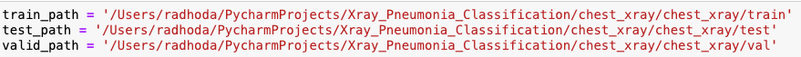

# X-Ray Pneumonia Detection

## Project Environment
- This project was done through the Anaconda program. You will first need to 
        download it and will be prompted with all necessary steps: 
``
https://www.anaconda.com/download 
``  
- After you have downloaded the program and followed through with the instructions, you will need to 
   download the Jupyter Notebook app within the Anaconda program.
- Once you have opened Jupyter, you will be prompted to select the folder you would like to work in. 
- You can select the chest_xray folder to create the new Jupyter file. 
- After selecting the folder, you will be directed to the web and a tab will be opened for a brand new iPython file, 
you are ready to begin.
## Library
- For the first block of code, we will begin by importing the necessary modules for this program.

- Note, you may need to install some of the modules or parent modules of those listed above. If needed,
Jupyter will notify you of the programs that are missing, and you can install the needed program in the
next line by simpling writing (replace the {} with the program name mentioned by Jupyter):
```
!pip install {PROGRAM_NAME}
```
## Dataset
The dataset used for this project can be found at https://www.kaggle.com/paultimothymooney/chest-xray-pneumonia. 
The dataset contains 5,856 check X-ray images of pediatric patients under the age of 5 from a medical center in Guangzhou, China.

## Coding Instructions

- After importing all modules that we will use, we will begin by assigning the absolute path of the
test, train, and val folders located within the chest_xray folder. Each folder will contain two folders, 
one consisting of x-ray lung images of healthy patients and the other of those suffering from pneumonia. 
- You will need to find the absolute path of each of these folders and assign them to a variable. 
- Note: Your path may differ from mine

- Next, we will need to initialize the batch_size, and image height and weight.
- We will then create a Data Generator object to modify our three data sets, namely adjusting the pixel scale

- We will then apply this to each of the three sets while also adding other default parameters

- Here we create the layers in the Convolutional Neural Network, followed by three dense layers

- Here we create an early stoppage so that when our training model begins to stagnate, 
we will be able to save computational time and reduce the number of iterations when it finds redundant
- We then create weights for each class, since the datasets of the two classes are not balanced.

- We then begin training the neural network, using 10 epochs. I had personal issues running any higher, as it took a very long time to compute.

- Once the model is trained, we can then evaluate the accuracy and check overall accuracy as well as
display a confusion matrix to indicate positives, negatives, false positives, and false negatives.
- We can then print out the report to provide precision and the f1-score. 

